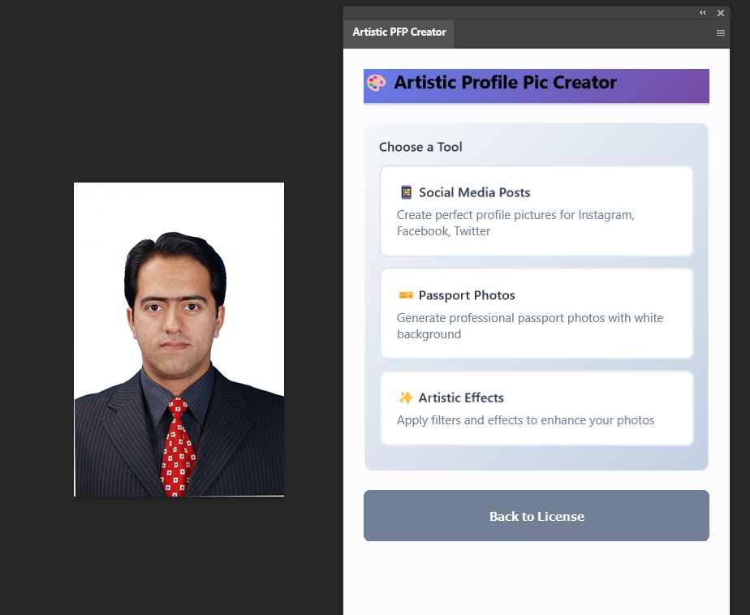
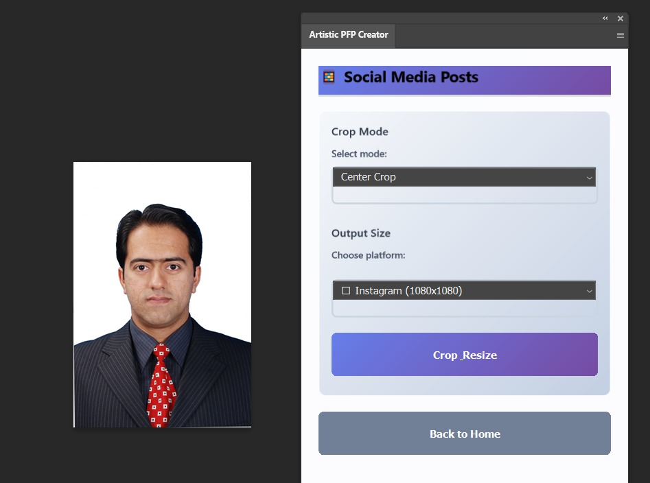
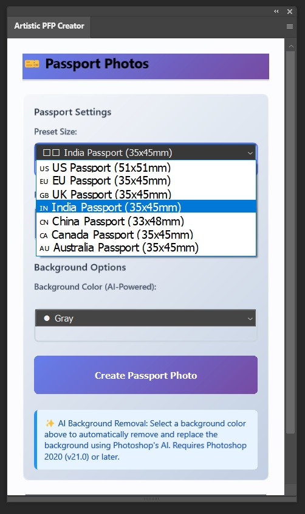
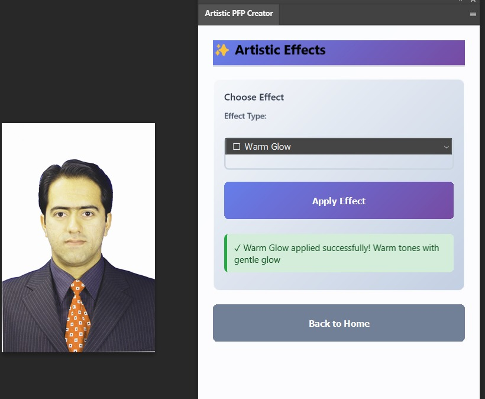

# Artistic PFP Creator

> Professional Photoshop plugin for creating social media profile pictures and passport photos with AI-powered background removal.

## Screenshots

### Main Interface

*Choose between Social Media Posts, Passport Photos, or Artistic Effects*

### Social Media Posts

*Create perfectly cropped and resized profile pictures for Instagram, Facebook, Twitter, and more*

### Passport Photos

*Generate professional passport photos with AI background removal for multiple countries*

### Artistic Effects

*Apply instant artistic filters like Warm Glow, Vibrant Pop, and more*

---

## Features

### 📱 Social Media Profile Pictures
Create perfectly sized profile pictures for:
- Instagram (1080×1080)
- Facebook (400×400)
- Twitter (180×180)
- LinkedIn (400×400)
- YouTube (800×800)
- TikTok (200×200)

### 🎫 Passport Photos
Generate passport photos with AI background removal:
- **7 Country Formats:** US, EU, UK, India, China, Canada, Australia
- **AI Background Removal:** Automatic subject detection using Photoshop's Select Subject
- **Custom Backgrounds:** White, light gray, light blue, or custom colors
- **Professional Quality:** 300 DPI resolution, precise dimensions

### 🎨 Artistic Effects
Apply instant artistic filters:
- Vibrant Pop
- Black & White
- Vintage Fade
- Warm Glow
- Cool Tone

## Installation

1. **Clone the repository:**
   ```bash
   git clone https://github.com/abdulrehman006/Artistic-pfp-creator.git
   ```

2. **Load in Photoshop:**
   - Open Adobe UXP Developer Tool
   - Click "Add Plugin"
   - Select the `artistic-pfp-creator` folder
   - Click "Load"

3. **Open the plugin:**
   - In Photoshop: Plugins → Artistic PFP Creator

## Requirements

- Adobe Photoshop 2023 or later
- For AI background removal: Photoshop 2020 (v21.0) or later

## Usage

1. Open any image in Photoshop
2. Launch the plugin from Plugins menu
3. Choose your desired feature:
   - **Social Media:** Select platform → Click Create
   - **Passport Photos:** Select country → Choose background color → Click Create
   - **Effects:** Select effect → Click Apply

## License & Usage

### License Activation

This plugin requires a valid license key to operate. The license system ensures:
- Secure activation with unique machine identification
- Offline mode support (works up to 90 days without server connection)
- Multi-device license management

### How to Activate

1. **Start the License Server:**
   ```bash
   # Navigate to license server directory
   cd license-server
   npm install
   npm start
   ```
   The server will run on `http://localhost:5000`

2. **Activate in Plugin:**
   - Open the plugin in Photoshop
   - Enter your license key in format: `PS-XXXX-XXXX-XXXX`
   - Click "Activate License"
   - Upon successful activation, all features will be unlocked

### License Features

- **Activation Limits:** Each license can be activated on a limited number of devices
- **Offline Mode:** Plugin continues working for 90 days without server connection
- **Device Management:** Deactivate from one device to activate on another
- **Secure Storage:** License state is stored locally and encrypted

### License Server

The plugin includes a Node.js license server that:
- Validates license keys against a SQLite database
- Tracks device activations and limits
- Provides offline mode support
- Logs all activation attempts for security

### Getting a License

For license inquiries and purchases, please contact: **abdulrehmann.swe@gmail.com**

## Support

For technical issues or questions, please contact: **abdulrehmann.swe@gmail.com**

## Copyright

Copyright © 2025 Abdul Rehman. All rights reserved.

This software is proprietary and confidential. Unauthorized copying, distribution, or use of this software, via any medium, is strictly prohibited without explicit written permission from the copyright holder.

---

**Version:** 4.1.0 | **Status:** Production Ready
